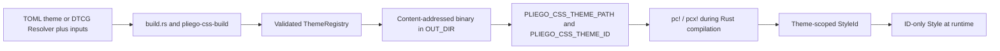

# Themes and tokens

PliegoCSS resolves named values through a typed `ThemeRegistry`. A color token cannot accidentally
serve as spacing, and a spacing token cannot satisfy a font-family utility. The registry is also
part of style identity, so the class name describes both normalized utility semantics and the exact
theme used to compile them.

## Seed first

Without a project theme, `pc!` and `pcx!` use the built-in seed registry. It contains the tokens and
the `sm`, `md`, and `lg` breakpoints required by the current utility catalog and fixtures.

```rust
use pliego_css::{Style, pc};

fn card() -> Style {
    pc!("rounded-lg bg-surface p-6 text-ink md:p-8")
}
```

This fallback is intentional: a project can begin without `build.rs`. It is also deterministic; the
seed registry has its own stable `ThemeId`.

## A custom theme extends the seed

Schema 1 always uses `extends = "seed"`. Project entries replace a seed token with the same
canonical name or add a new token to that namespace.

```toml
# pliego.theme.toml
schema = 1
extends = "seed"

[tokens.color]
brand = "oklch(62% .21 29)"
accent = "oklch(58% .24 28)"

[tokens.spacing]
gutter = "1.375rem"

[tokens.radius]
panel = ".875rem"

[breakpoints]
tablet = "52rem"
```

After the build bridge is enabled, these names participate in ordinary compile-time validation:

```rust
use pliego_css::{Style, pc};

fn panel() -> Style {
    pc!("rounded-panel bg-brand p-gutter tablet:p-8")
}
```

## Build-time flow



Add the bridge as a build dependency:

```toml
[dependencies]
pliego-css = { path = "../PliegoCSS/crates/pliego-css" }

[build-dependencies]
pliego-css-build = { path = "../PliegoCSS/crates/pliego-css-build" }
```

Then create `build.rs`:

```rust,no_run
fn main() {
    pliego_css_build::theme!("pliego.theme.toml");
}
```

The DTCG alternative selects one Resolver permutation:

```rust,no_run
fn main() {
    pliego_css_build::theme!(
        tokens = "product.resolver.json",
        inputs = {
            "appearance" => "dark",
        },
    );
}
```

Relative paths are resolved from the package's `CARGO_MANIFEST_DIR`. Cargo reruns the script when
the theme or Resolver file changes. The bridge parses it only in the build process, writes a canonical binary
`pliego-css-theme-v1-{theme_id}.bin` artifact atomically under `OUT_DIR`, and exports its path and
identity to the crate compilation. The filename carries both the binary format version and the
registry identity. `inputs = {}` selects declared Resolver defaults; names and contexts are string
literals, and exact or case-fold duplicate modifier entries fail closed. Call `theme!` once per
package. A DTCG build artifact contains only the selected registry, not every Resolver permutation.

The application runtime parses neither TOML nor DTCG JSON and does not generate CSS. A `Style`
holds only its 128-bit `StyleId`, and the browser receives static standards-compliant CSS.

## How token values reach CSS

The registry-aware compiler APIs lower and emit against the same `ThemeRegistry`:

```rust,no_run
use pliego_css_compiler::{emit_css_with_theme, emit_theme, lower_style_with_theme};
use pliego_css_config::parse_path;
use pliego_css_parser::parse_style_list;

fn main() -> Result<(), Box<dyn std::error::Error>> {
    let theme = parse_path("pliego.theme.toml")?;
    let syntax = parse_style_list("bg-brand p-gutter tablet:p-8")?;
    let style = lower_style_with_theme(&theme, &syntax)?;
    let css = format!(
        "{}{}",
        emit_theme(&theme),
        emit_css_with_theme(&theme, &style)?
    );
    std::fs::write("app.css", css)?;
    Ok(())
}
```

Color tokens other than the direct `transparent`, `current`, and `white` values use
`--color-{name}` variables. Font families use `--font-{name}` variables. `emit_theme` writes those
variables; spacing, type scale, weight, line height, letter spacing, radius, and shadow values are
emitted directly into the generated utility declarations.

The workspace CLI can load the same TOML with `--config`, extract visible macro literals from an
explicitly supplied Rust file with `--source`, and emit variables for the active registry with
`--theme`:

```console
cargo run -p pliego-cssc -- compile --source src --config pliego.theme.toml --theme --output app.css
```

`--config`, `--seed`, and `--tokens` are mutually exclusive. When all three are absent, the CLI
discovers a unique `pliego.theme.toml` from the working directory and the nearest package roots of
supplied input/source paths. Discovery stops at `Cargo.toml`; multiple matching themes are rejected.
Use `--seed` to opt out explicitly. `--tokens` selects only the named DTCG Resolver JSON; JSON is
never discovered.

`--source` accepts one Rust file or recursively scans a directory. A directory scan includes every
discovered `.rs` file; it is not semantic Cargo reachability analysis. Direct `--style`,
`--compose`, and line-oriented `--input` sources remain available. The default schema-3 manifest
records the StyleId/class/ThemeId format versions, `themeId`, target contract, source origins, and
the emitted CSS hash and byte count. Check
the exact current options in the [CLI reference](../reference/cli.md).

Direct CLI DTCG compilation can use `--style`/`--input`/`--source` with `--tokens` and repeatable
`--token-input modifier=context`. Configure Cargo with the Resolver form of `theme!` and repeat the
same file and selections in the CLI command. That shared selected registry keeps `pc!`/`pcx!`
identities and generated CSS coherent; controlled CLI output additionally publishes the complete
all-permutation graph.

For explicit one-shot assets, bundle-plan schema 2 puts the same selection in TOML:

```toml
schema = 2
targets = "modern"
format = "minified"

[theme]
kind = "dtcg-resolver"
path = "product.resolver.json"

[theme.inputs]
appearance = "dark"
```

There are no bundle DTCG flags. Schema 1 remains seed/config-only. Controlled schema-2 output uses
the selected registry but publishes the complete graph, ledgers exact Resolver bytes as
`token-resolver`, and binds exact plan bytes to `configHash`; textually different plans remain
distinct snapshots. Invalid selection fails before publication. The local bundle gates pass, and the
Cargo macro uses the direct Resolver form above rather than reading the bundle plan.

## Identity is a correctness boundary

Changing any token or breakpoint changes `ThemeId`, even if one particular style does not reference
the changed definition. StyleId format 2 encodes both `THEME_ID_FORMAT_VERSION = 3` and the complete
`ThemeId` before hashing the tagged semantic stream with SHA-256. This partitions identities from
different registries. The emitter independently recomputes the
expected identity and reports a mismatch if a style compiled under one theme is emitted under
another.

This means the Rust macro and CSS generation step must use the same canonical registry. Do not copy
or edit files under `OUT_DIR`, and do not manually set the two `PLIEGO_CSS_THEME_*` variables.
Auto-discovery helps align conventional TOML layouts. For TOML, repeat the build-script path as
`--config` in the CSS command. For DTCG, repeat the Resolver as `--tokens` and mirror its inputs
with `--token-input`; DTCG JSON is never discovered.

The theme identity and binary remain format 1; the StyleId stream is independently format 2. The
class encoder also remains format 1, but classes from the earlier StyleId format-1 candidate cannot
be reused. Opt-in schema 4 additionally records direct declaration-to-token dependencies under the
same `ThemeId`; schema 5 preserves those dependencies and attributes emitted theme variables to its
synthetic theme producer. Recompile macro/SSR/SSG output and regenerate CSS/manifests together; see
the exact [StyleId format-2 migration](../reference/style-id-format-v2.md#migration-from-the-format-1-candidate).

Next: read the exact [theme schema](../reference/theme-schema.md), configure
[custom breakpoints](../how-to/custom-breakpoints.md), or diagnose a
[theme build error](../troubleshooting/themes.md).
