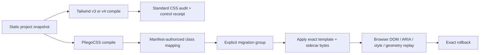

# Adapter coexistence and bounded Tailwind migration

Status: **G6 bounded contract**

PliegoCSS supports a conservative migration slice for literal, complete utility groups in plain
HTML, Vite production output, and PliegoRS rendered HTML. It is designed for coexistence: Tailwind
stays loaded while selected markup switches to compiler-generated `pc_` classes and a PliegoCSS
sidecar.

## Architecture



The compiler manifest, not a regex-derived utility guess, authorizes each source-group-to-class
mapping. The adapter accepts only canonical double-quoted `class` attributes. `className`, Vue
bindings, interpolation, embedded scripts/styles, and non-literal groups are rejected by schema 1.

## What coexistence means

Before apply, the document loads Tailwind CSS and an empty `pliego.css`. The approved group changes
only the complete class values and the Pliego sidecar bytes. Tailwind remains byte-identical and
loaded after apply. That lets teams migrate bounded templates or routes without making removal of
Tailwind part of the same irreversible action.

Rollback checks the current after hashes, restores the exact before bytes, and removes the receipt.
Drift after apply blocks rollback rather than overwriting user changes.

## Tailwind output audit

Each project uses one pinned competitor profile:

- `tailwindcss@3.4.19`, the upstream `v3-lts` lane, with `@tailwind utilities` and Preflight off;
- `tailwindcss@4.3.3`, the current lane at contract creation, using CSS imports and Preflight off.

The emitted CSS passes ordinary standard-CSS audit twice: publish the control group, then recompute
it in `--check` mode. Warnings remain visible in evidence; any error blocks the project.

## Evidence boundary

The tracked corpus contains 21 unique project documents: seven HTML, seven Vite, and seven PliegoRS
rendered-output cases. Every project must pass DOM, ARIA, computed-style, layout-geometry, apply, and
rollback checks. Vite cases also run `vite build`. The hosted matrix replays all 21 on Windows,
Linux, and macOS Chromium, for 63 project/host replays, and requires the separate pinned PliegoRS
framework browser job.

This does not prove arbitrary Tailwind compatibility, plugin execution, safe dynamic codemods,
Tailwind removal, or external adoption. Those seams fail closed or remain G7 work.

## Commands

```console
pnpm check:adapter-coexistence-authority
pnpm check:adapter-coexistence -- --browser=chromium
pnpm check:adapter-coexistence-matrix -- \
  --evidence-root=target/adapter-coexistence-certification/incoming \
  --pliegors-evidence=target/adapter-coexistence-certification/pliegors/pliegors-framework.json \
  --require-clean
```

The authority is
[`benchmarks/adapter-coexistence-v1/authority.json`](../../benchmarks/adapter-coexistence-v1/authority.json),
and the project snapshots are in its hash-bound `corpus.json`.
